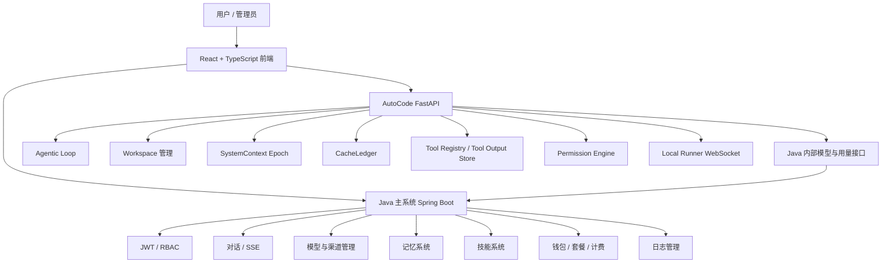
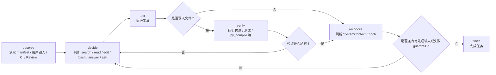
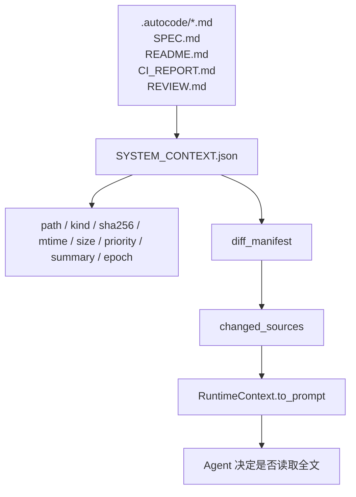
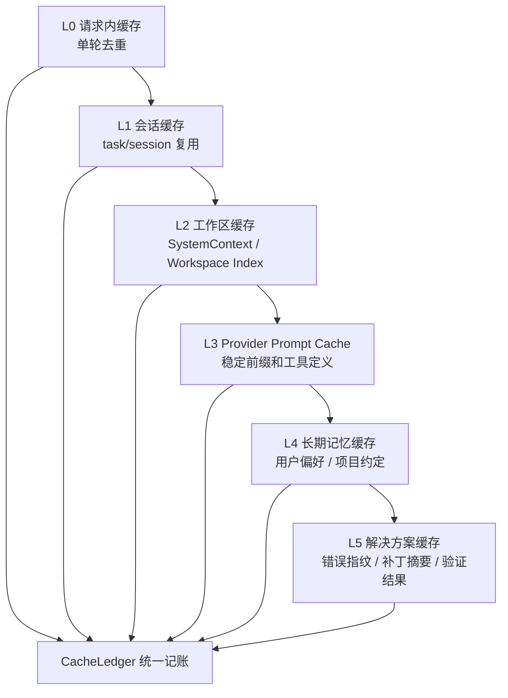
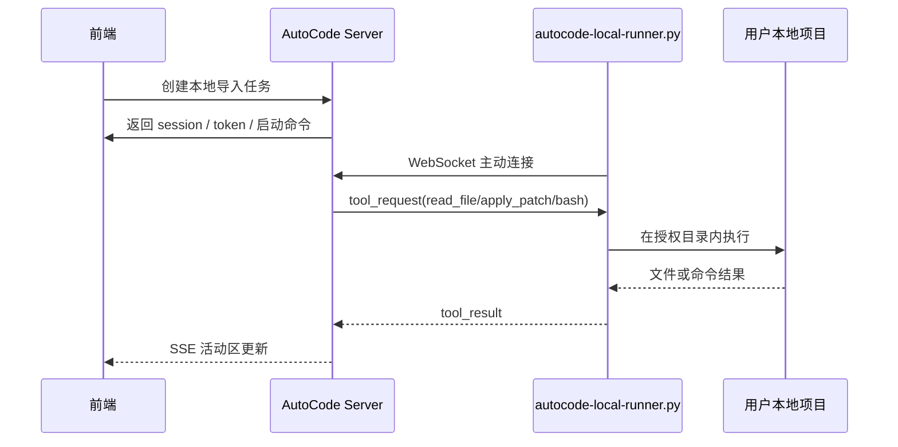
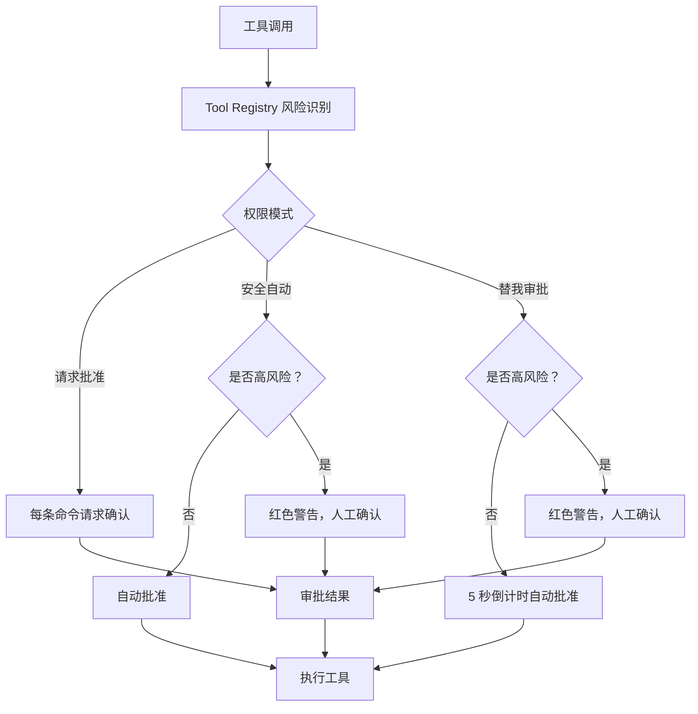
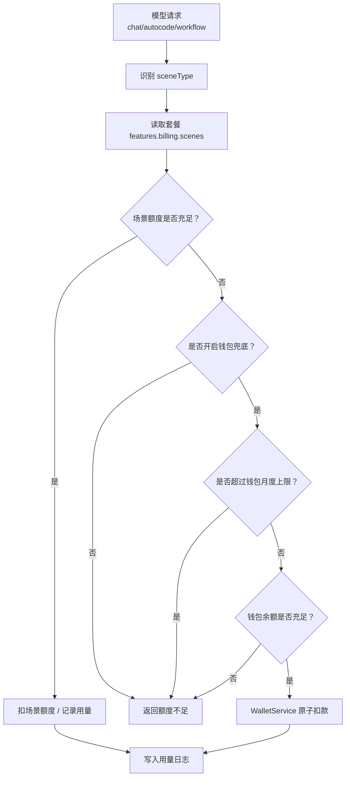

# 架构图与流程图

## 1. 总体架构

```mermaid
flowchart TB
    User["用户 / 管理员"] --> FE["React + TypeScript 前端"]
    FE --> Java["Java 主系统 Spring Boot"]
    FE --> AutoCode["AutoCode FastAPI"]

    Java --> Auth["JWT / RBAC"]
    Java --> Chat["对话 / SSE"]
    Java --> Model["模型与渠道管理"]
    Java --> Memory["记忆系统"]
    Java --> Skill["技能系统"]
    Java --> Billing["钱包 / 套餐 / 计费"]
    Java --> Log["日志管理"]

    AutoCode --> Loop["Agentic Loop"]
    AutoCode --> Workspace["Workspace 管理"]
    AutoCode --> Context["SystemContext Epoch"]
    AutoCode --> Cache["CacheLedger"]
    AutoCode --> Tool["Tool Registry / Tool Output Store"]
    AutoCode --> Permission["Permission Engine"]
    AutoCode --> Runner["Local Runner WebSocket"]

    AutoCode --> JavaAPI["Java 内部模型与用量接口"]
    JavaAPI --> Java
```

## 2. Agentic Loop

```mermaid
flowchart LR
    A["observe<br/>读取 manifest / 用户输入 / CI / Review"] --> B["decide<br/>判断 search / read / edit / bash / answer / ask"]
    B --> C["act<br/>执行工具"]
    C --> D{"是否写入文件？"}
    D -- 是 --> E["verify<br/>运行构建 / 测试 / py_compile 等"]
    D -- 否 --> F["reconcile<br/>刷新 SystemContext Epoch"]
    E --> G{"验证是否通过？"}
    G -- 否 --> B
    G -- 是 --> F
    F --> H{"是否还有待处理输入或失败 guardrail？"}
    H -- 是 --> B
    H -- 否 --> I["finish<br/>完成任务"]
```

## 3. SystemContext Epoch

```mermaid
flowchart TB
    Sources[".autocode/*.md<br/>SPEC.md<br/>README.md<br/>CI_REPORT.md<br/>REVIEW.md"] --> Manifest["SYSTEM_CONTEXT.json"]
    Manifest --> Fields["path / kind / sha256 / mtime / size / priority / summary / epoch"]
    Manifest --> Diff["diff_manifest"]
    Diff --> Changed["changed_sources"]
    Changed --> Prompt["RuntimeContext.to_prompt"]
    Prompt --> Agent["Agent 决定是否读取全文"]
```

## 4. 缓存分层

```mermaid
flowchart TB
    L0["L0 请求内缓存<br/>单轮去重"] --> L1["L1 会话缓存<br/>task/session 复用"]
    L1 --> L2["L2 工作区缓存<br/>SystemContext / Workspace Index"]
    L2 --> L3["L3 Provider Prompt Cache<br/>稳定前缀和工具定义"]
    L3 --> L4["L4 长期记忆缓存<br/>用户偏好 / 项目约定"]
    L4 --> L5["L5 解决方案缓存<br/>错误指纹 / 补丁摘要 / 验证结果"]
    L0 --> Ledger["CacheLedger 统一记账"]
    L1 --> Ledger
    L2 --> Ledger
    L3 --> Ledger
    L4 --> Ledger
    L5 --> Ledger
```

## 5. 本地 Runner

```mermaid
sequenceDiagram
    participant UI as 前端
    participant Server as AutoCode Server
    participant Runner as autocode-local-runner.py
    participant FS as 用户本地项目

    UI->>Server: 创建本地导入任务
    Server->>UI: 返回 session / token / 启动命令
    Runner->>Server: WebSocket 主动连接
    Server->>Runner: tool_request(read_file/apply_patch/bash)
    Runner->>FS: 在授权目录内执行
    FS-->>Runner: 文件或命令结果
    Runner-->>Server: tool_result
    Server-->>UI: SSE 活动区更新
```

## 6. 权限审批

```mermaid
flowchart TB
    ToolCall["工具调用"] --> Risk["Tool Registry 风险识别"]
    Risk --> Mode{"权限模式"}
    Mode -- 请求批准 --> AskAll["每条命令请求确认"]
    Mode -- 安全自动 --> Safe{"是否高风险？"}
    Mode -- 替我审批 --> Auto{"是否高风险？"}
    Safe -- 否 --> Allow1["自动批准"]
    Safe -- 是 --> Confirm1["红色警告，人工确认"]
    Auto -- 否 --> Countdown["5 秒倒计时自动批准"]
    Auto -- 是 --> Confirm2["红色警告，人工确认"]
    AskAll --> Approval["审批结果"]
    Allow1 --> Execute["执行工具"]
    Confirm1 --> Approval
    Countdown --> Execute
    Confirm2 --> Approval
    Approval --> Execute
```

## 7. 统一计费

```mermaid
flowchart TB
    Request["模型请求<br/>chat/autocode/workflow"] --> Scene["识别 sceneType"]
    Scene --> Policy["读取套餐 features.billing.scenes"]
    Policy --> Quota{"场景额度是否充足？"}
    Quota -- 是 --> UseQuota["扣场景额度 / 记录用量"]
    Quota -- 否 --> Wallet{"是否开启钱包兜底？"}
    Wallet -- 否 --> Reject["返回额度不足"]
    Wallet -- 是 --> Limit{"是否超过钱包月度上限？"}
    Limit -- 是 --> Reject
    Limit -- 否 --> Balance{"钱包余额是否充足？"}
    Balance -- 否 --> Reject
    Balance -- 是 --> Charge["WalletService 原子扣款"]
    UseQuota --> Ledger["写入用量日志"]
    Charge --> Ledger
```

